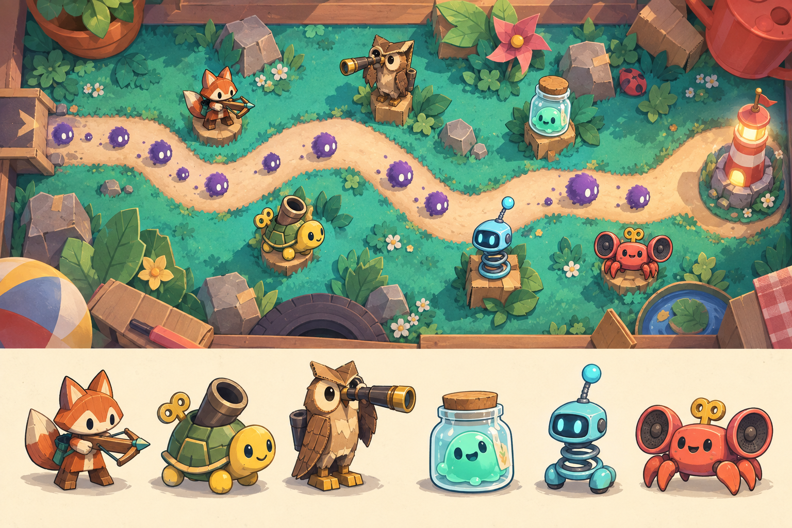
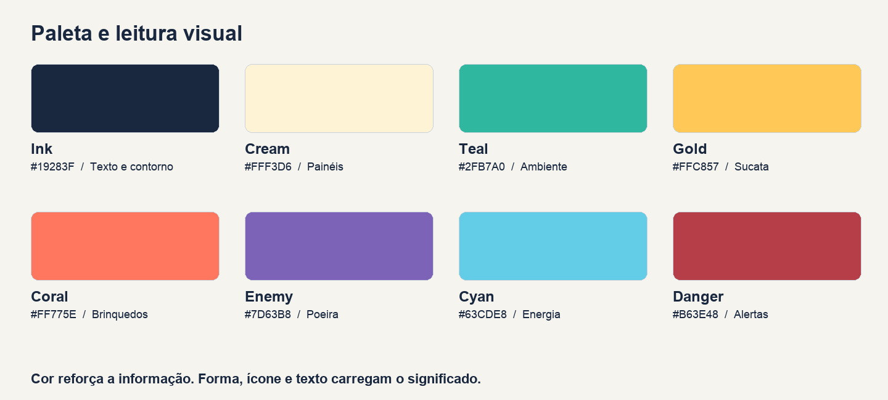
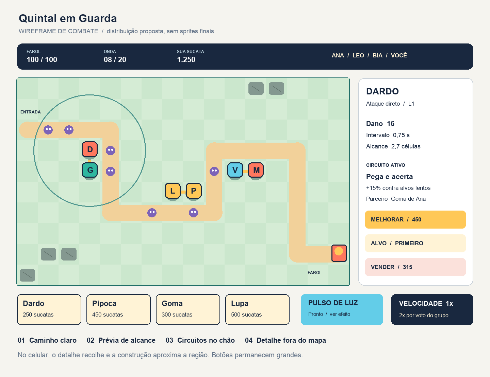

# Direção de arte de Quintal em Guarda

## Objetivo visual

Criar um pequeno mundo de brinquedos com aspecto artesanal, formas grandes e personagens expressivos. A arte precisa comunicar função antes de detalhe: uma raposa com disparador é ataque rápido, uma tartaruga com tubo largo é explosão, uma coruja com luneta é alcance. O cenário deve convidar a jogar e continuar legível depois que houver dezenas de inimigos na tela.

Esta direção acompanha o game design e a especificação técnica. A prancha conceitual foi gerada com a ferramenta de imagens integrada ao Codex. Ela é referência de personagem, cor e material; não é screenshot de um jogo existente, arquivo de sprites, mapa implementado ou garantia de consistência quadro a quadro. O prompt utilizado está em arte/PROMPT_CONCEITO.txt.

O layout de produção usa a grade e os caminhos ortogonais do catálogo. Não copiar literalmente as curvas, os pedestais ou a perspectiva ilustrada da prancha para a geometria de jogo. A especificação do tabuleiro tem precedência; preservar o caráter acolhedor, os materiais de brinquedo e as silhuetas.

Na versão 1.1, o pacote inclui 40 PNGs individuais na pasta Assets_Quintal_em_Guarda_v1: 30 estados de torres, três terrenos e sete imagens de cenário e base. Eles são poses estáticas utilizáveis na implementação. O capítulo de integração explica caminhos, upload, escala, movimentos procedurais e os quadros de animação ainda pendentes.

## Linguagem visual

Ilustração 2D cartoon com contorno azul muito escuro, cores chapadas e até duas faixas de sombra. Cenários usam textura suave de papel; personagens e inimigos devem manter áreas de cor limpas. O volume é desenhado, sem iluminação 3D dinâmica. O ambiente usa visão superior; os personagens são sprites com rosto visível e pés ancorados no tabuleiro, como peças vistas de cima em três quartos.

As formas aliadas são arredondadas, estáveis e montadas com peças reconhecíveis. Os inimigos são assimétricos, macios e escuros, com olhos claros. Os chefes ampliam uma ideia simples, como um aspirador que virou criatura, em vez de acumular muitos acessórios. Violência é de brinquedo: desmontar, soltar poeira e saltar; sem sangue ou sofrimento realista.

Usar uma fonte de luz desenhada no alto à esquerda e sombra elíptica curta separada do sprite. A sombra fica debaixo dos pés, não dentro da textura do personagem, para evitar duplicação. Contornos externos: 3 a 4 px no export de 128 px; detalhes internos: 1 a 2 px, eliminados quando atrapalharem leitura.

### O que aprovar e o que recusar

| Aprovar | Recusar |
| --- | --- |
| Silhueta distinguível em 32 px | Seis personagens com o mesmo corpo e cores diferentes |
| Arma ou acessório que explica a função | Muitos enfeites menores que um pixel na tela |
| Upgrade altera forma e material | Upgrade que só troca número ou brilho |
| Cenário suave com caminho evidente | Textura tão contrastada quanto os inimigos |
| Efeito curto com ponto de impacto visível | Explosão que cobre a rota inteira |
| Pele cosmética mantém função e escala | Skin que parece outra torre ou oculta status |

## Paleta e semântica

| Token | Cor | Aplicação |
| --- | --- | --- |
| ink | #19283F | Contornos, texto escuro e foco |
| cream | #FFF3D6 | Painéis e fundo claro |
| teal | #2FB7A0 | Ambiente vivo e ações positivas |
| gold | #FFC857 | Sucata, melhoria e energia do farol |
| coral | #FF775E | Ênfase e personalidade dos brinquedos |
| enemy | #7D63B8 | Família de poeira e Breu |
| cyan | #63CDE8 | Energia, alcance e corrente |
| danger | #B63E48 | Alerta com ícone e texto |
| muted | #66768A | Informação secundária sobre fundo claro |

Usar ink sobre cream para texto principal. Não usar texto branco pequeno sobre gold, cyan ou teal. Informações de sucesso, erro e dono incluem ícones, padrões ou rótulos além da cor. Medir contraste do produto final: meta de 4,5:1 para texto normal e 3:1 para texto grande. Esses são critérios de QA visual do projeto.

As cores de donos usam círculo, quadrado, triângulo e losango nos marcadores, além de quatro tonalidades. Resistência física usa escudo de lata; resistência de energia usa espiral; cura usa remendo; lentidão usa gota com seta. Não reaproveitar o mesmo símbolo para moeda e energia.

## Personagens aliados

### Dardo

Raposa de madeira laranja, orelhas triangulares, cauda larga e disparador de elástico. Corpo compacto e atitude curiosa. L0 tem disparador simples; L1 ganha braçadeira; L2 tem mecanismo duplo. Rajada acrescenta tambor pequeno e pose inclinada. Fura lata usa ponta metálica maior e mira curta. O rosto e a cauda continuam reconhecíveis em todas as skins.

### Pipoca

Tartaruga de corda com casco circular e tubo largo nas costas. Amarelo e verde escuro. L0 tem tubo curto; L1 reforço no casco; L2 acrescenta aro e manivela. Festival abre um bocal mais largo e pequenas bandeiras. Demolidora ganha tampa metálica e tubo mais comprido, sem parecer um tanque realista. A animação contrai o casco antes do disparo.

### Lupa

Coruja alta de papelão com olhos grandes e luneta, usando tons de papel, âmbar e marrom. L1 acrescenta suporte; L2 amplia a luneta. Olho de águia alonga a lente e adiciona uma pena triangular. Observadora usa lente dupla e pequeno marcador luminoso. Silhueta vertical, comparada à largura de Pipoca.

### Goma

Criatura verde menta dentro de um pote transparente com tampa de cortiça. Seu rosto fica em uma área sólida clara para não desaparecer com transparência. L1 recebe faixa; L2 ganha bocal. Poça tem dois bicos laterais. Supercola tem tampa reforçada e uma gota grande no topo. Transparência do pote é desenhada por áreas, evitando camadas de alpha custosas.

### Voltz

Robô ciano de cabeça arredondada, rosto em visor escuro, corpo de mola e antena. L1 adiciona um anel; L2 alarga a bobina. Tempestade divide a antena em três pontas arredondadas. Alta tensão usa uma única esfera grande e bobina mais grossa. O brilho nunca deve esconder os olhos nem copiar o formato de um inimigo.

### Maestro

Caranguejo coral com rádio, dois alto-falantes e chave de corda. L0 tem caixas pequenas; L1 ganha botão frontal; L2 amplia as caixas. Orquestra abre os alto-falantes para os lados. Solo usa corneta central compacta. Movimento de pinças marca o ritmo da aura. Sua animação de apoio ocupa o lugar da animação de ataque.

## Inimigos e chefes

| Entidade | Silhueta e sinais | Animação de leitura |
| --- | --- | --- |
| Fiapo | Pequena bola violeta com dois olhos | Saltos curtos |
| Corrisco | Gota estreita com rastro curto | Corrida inclinada |
| Bolota | Corpo redondo largo e pesado | Compressão lenta |
| Latinha | Poeira dentro de lata quadrada | Passos duros e escudo visível |
| Névoa | Espiral achatada com borda pontilhada | Ondulação suave |
| Remendo | Saquinho com costura em cruz | Pulso de costura ao curar |
| Casulo | Casca oval rachada | Tremor antes de se dividir |
| Brutamontes | Corpo largo e dois braços de pano | Passos lentos e ombros altos |
| Aspirador | Corpo oval, mangueira e cara irritada | Inspiração de 2 s antes da poeira |
| Rei Ferrugem | Lata alta com coroa de tampinhas | Placas se fecham antes da armadura |
| Breu | Cobertor estrelado com olhos e pernas curtas | Costura brilha antes de invocar |

Vida, resistência e habilidade nunca são comunicadas apenas pela aparência. Chefes têm barra própria e ícone de estado. O desenho de Breu mantém humor e expressão; evitar horror realista. Fiapos gerados por Casulo são menores e não exibem símbolo de recompensa.

## Cenários e composição

Os três mapas usam exatamente as coordenadas do catálogo. O chão é visualmente contínuo, enquanto o caminho tem borda clara e pequenas setas nas curvas. Células de construção ficam discretas e aparecem melhor durante posicionamento. Props decorativos nunca invadem o corredor interativo de uma célula válida.

Jardim de Papel usa gramado teal, caminho de areia clara, plantas de papel e pedras de papelão. Predominam verde, creme e coral. O Farol de Pilha é pequeno, amarelo e coral, com janela iluminada. Entrada tem seta clara; saída tem conexão física com o farol.

Oficina de Lata usa bancada azul acinzentada, fita adesiva creme como rota, parafusos e caixas nas bordas. A estrada continua mais clara que o fundo. Não usar grades decorativas que possam ser confundidas com a grade de construção.

Sótão das Estrelas usa madeira escura dessaturada, tecido azul e estrelas de papel. O caminho continua claro mesmo com ambiente noturno. Pontos de luz pertencem à decoração; alertas de combate usam outra forma e movimento. Nenhum efeito de escuridão pode esconder posicionamento ou vida.

## Interface de combate

O wireframe mostra hierarquia e distribuição, não arte pronta do jogo. As letras dentro das peças são rótulos para a documentação; serão substituídas por sprites e retratos. Dimensões do produto se adaptam ao dispositivo por BoardTransform.

HUD usa painéis creme, cantos de 12 px e contorno ink de 2 px na escala de referência de 1280 px. Botão primário é gold com texto ink. Botão secundário usa cream. Danger aparece em venda e saída com confirmação explícita. Estado indisponível preserva texto legível e explica a razão, como “Faltam 120 sucatas”.

Tipografia de interface: Fredoka para nomes e títulos curtos, e família sem serifa do catálogo Roblox disponível no ambiente para números e textos longos. Verificar disponibilidade antes de fixar FontFace; fallback é Builder Sans ou fonte nativa equivalente verificada. Não incorporar fonte externa sem licença. No produto, tamanhos são metas após escala: corpo 16 a 18 px, números principais 20 a 24 px, títulos 28 a 36 px.

No celular em paisagem, reduzir decoração do HUD, recolher painel de detalhes e manter atalhos no polegar. Testar pelo menos 844×390, 896×414, 1280×720 e 1920×1080, mais um tablet 4:3. Respeitar safe areas. Em orientação vertical, mostrar orientação para girar o dispositivo e manter acesso a sair e configurações; não anunciar gameplay vertical otimizado.

## Movimento e efeitos

| Ação | Duração proposta | Direção |
| --- | --- | --- |
| Hover ou foco | 100 ms | Escala até 1,03 |
| Clique confirmado | 80 ms | Pequena compressão e retorno |
| Construção | 180 ms | Entrada por escala sem deslocar célula |
| Melhoria | 350 ms | Silhueta troca no meio do brilho |
| Disparo comum | 200 a 330 ms | Antecipação curta e recuo |
| Impacto | 120 a 220 ms | Ponto de contato e partícula curta |
| Morte comum | 250 a 400 ms | Poeira se dissolve |
| Aviso de chefe | 2 s | Contorno e ícone com pulsação lenta |

Animações de sprites usam 12 fps como base, independentes do passo de simulação. Disparo desenhado pode ser abreviado em 2x. Modo de movimento reduzido desliga tremor de tela, saltos de painel e pulsação decorativa; avisos continuam por contorno estático e texto. Nenhum flash em tela inteira é necessário.

Circuitos usam fio fino e pontos de conexão sob as unidades. Mostrar todos discretamente; dar ênfase apenas à seleção e a uma nova ativação. Dano flutuante agrega impactos da mesma torre no mesmo alvo em janelas curtas, é opcional e tem limite de 30 números visíveis. Auras não precisam redesenhar círculos grandes permanentemente.

## Áudio

Criar quatro loops musicais: menu e um por mapa, de 60 a 90 s, emenda sem clique, volume abaixo dos avisos. Instrumentos de brinquedo, percussão de madeira e sintetizador leve, sem imitar melodias de franquias. Chefes podem acrescentar uma camada de tensão ao loop existente.

Pacote mínimo de 24 efeitos: seis disparos ou apoios de torre; três impactos; três aparições ou habilidades de chefe; quatro ações de UI; três avisos de partida; três eventos de resultado ou desbloqueio; dois sons de base. Normalizar volume relativo e limitar repetição dos ataques. Avisos importantes têm equivalente visual. Registrar origem e direito de uso de cada áudio no manifesto.

## Especificação de assets

| Grupo | Quantidade inicial | Entrega |
| --- | --- | --- |
| Torres | 6 personagens × 5 estados | 30 poses entregues; 240 quadros finais ainda a produzir |
| Inimigos comuns | 8 × 12 quadros | 96 quadros |
| Chefes | 3 × 16 quadros | 48 quadros |
| Cenários | 3 | Fundo, caminho e props separados |
| Retratos | 6 base e variantes de skin | Recortes quadrados com área segura |
| Interface | 24 ícones funcionais | Fonte vetorial e PNG exportado |
| Efeitos | 12 famílias | Pequenos atlas ou formas nativas |
| Skins Fundador | 6 × 5 estados | Variação visual sem mudar silhueta de função |
| Skins de domínio | 6 × 5 estados | Variação visual após 250 pontos |
| Divulgação | 1 ícone e 2 thumbnails | Composição própria após validar o produto |

As skins podem reutilizar animação e estrutura dos estados, mas exigem revisão em todos os quadros. Não contabilizá-las como custo artístico zero. Adesivos de domínio: seis. Títulos: seis de domínio e um Fundador. Estandartes: padrão e Fundador. A produção pode começar sem a loja para priorizar o elenco base.

### Quadros e atlas

Torres: originais estáticos entregues em 1254×1254; normalizar fonte de quadro para 512×512 e export de jogo para 128×128 RGBA durante a integração. Um atlas de 1024×1024 por torre, com oito colunas. Linhas 0 a 4 correspondem a L0, L1, L2, L3A e L3B. Colunas 0 a 3 são idle; 4 a 7 são ataque ou apoio. Restante transparente. A área desenhada fica dentro de 112×112, com margem para evitar sangramento. Posição dos pés igual em todos os quadros.

Inimigos comuns: quadro de 128×128, seis frames de caminhada, dois de impacto e quatro de morte. Dois atlas 1024×1024 comportam quatro inimigos cada, usando duas linhas de oito células por inimigo; as últimas quatro células do bloco ficam transparentes. Chefes: quadro de 256×256, oito frames de movimento, quatro de habilidade e quatro de morte; cada chefe usa um atlas 1024×1024 com 16 células.

Cada frame usa ImageRectOffset calculado por coluna e linha e ImageRectSize igual ao tamanho do quadro. Não usar margem externa que altere essa conta. Não espelhar sprites inteiros com letras ou emblemas assimétricos. A versão 1 usa uma pose principal; a direção do alvo é comunicada pelo projétil e um pequeno recuo, evitando girar todo o personagem de cabeça para baixo.

Fundos: os originais entregues medem 1586×992; preparar export de 1600×1000 por mapa, desenho limpo em 16:10, com camada de caminho separada e máscara de construção em dados. Interface usa PNGs pequenos ou elementos nativos. Manter fontes vetoriais ou arquivos em camadas fora do lugar Roblox. Asset final deve existir no repositório e no manifesto, sem depender do histórico de uma ferramenta de imagem.

Um atlas RGBA 1024×1024 ocupa aproximadamente 4 MiB quando decodificado sem considerar overhead. Seis de torres, dois de inimigos e três de chefes representam cerca de 44 MiB. Carregar somente o chefe e as skins usados na partida; reservar até 96 MiB para texturas próprias, incluindo variantes dos quatro jogadores, cenário e interface. Validar o pior caso em aparelhos reais. Tamanho do PNG comprimido não é medida suficiente de memória.

### Nomes e manifesto

Padrão: tower_dardo_default_atlas_v001.png, enemy_common_a_atlas_v001.png, boss_aspirador_atlas_v001.png, map_jardim_background_v001.png e ui_currency_scrap_v001.png. Usar ASCII nos nomes técnicos, IDs estáveis e versões explícitas. Não sobrescrever uma versão já usada em produção sem registrar a mudança.

Manifesto exige assetKey, localFile, robloxAssetId, width, height, frameWidth, frameHeight, anchor, author, usageRights, moderationStatus e version. robloxAssetId fica vazio até upload real. Se uma imagem for rejeitada ou não carregar, apresentar fallback legível e registrar erro; a partida não pode ficar invisível.

## Divulgação e consistência

Ícone inicial proposto: Dardo em primeiro plano e o Farol de Pilha ao fundo, com um Fiapo indicando ameaça. Thumbnail 1 mostra um Circuito entre dois personagens; thumbnail 2 mostra quatro jogadores por retratos defendendo contra Aspirador. Usar captura real quando o jogo existir e separar qualquer ilustração promocional. Não prometer funcionalidades ausentes.

Antes do upload, verificar as dimensões e regras vigentes do Creator Hub. Os arquivos mestres podem ser quadrados e 16:9 em alta resolução, mas o formato final deve seguir os requisitos reais da plataforma.

## Aprovação visual

Uma torre é aprovada quando sua silhueta é reconhecível a 32 px, a função aparece a 48 px e os cinco estados são distintos sem depender do texto. Uma skin mantém esses critérios. Um mapa é aprovado quando caminho, entrada, saída e célula inválida são reconhecidos em até três segundos de observação no celular.

Revisar combate cheio em 1x e 2x, com partículas reduzidas e em escala de cinza. Confirmar que ícones de resistência sobrevivem à redução, o chefe não esconde a base, a interface cabe nas áreas seguras e todo botão oferece resposta de foco e toque. Aprovar primeiro Dardo completo e uma cena do Jardim como amostra de qualidade; depois produzir o restante do elenco com a mesma régua.
